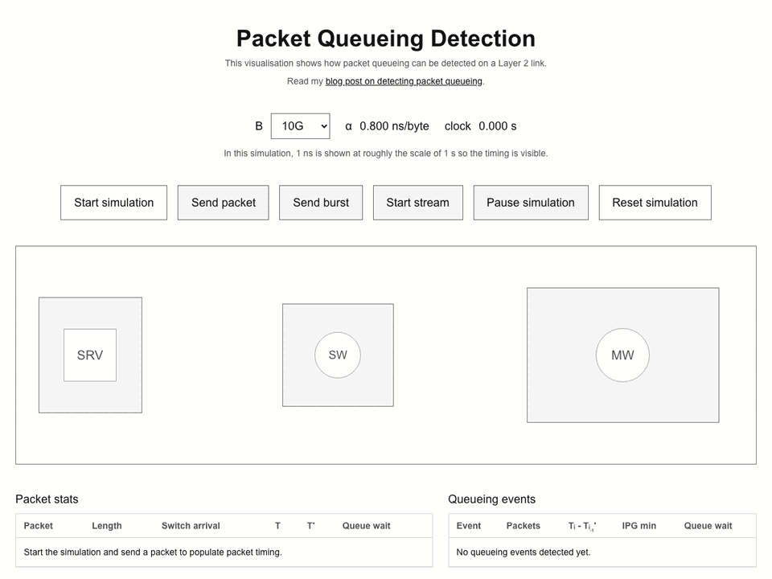

# packet-queuing-ui

A visualisation for my [blog post](https://prnvbn.dev/posts/packet-queueing/) on detecting layer 2 packet queuing.

## Demo

[Watch the full WebM demo](docs/packet-queueing-demo.webm).
